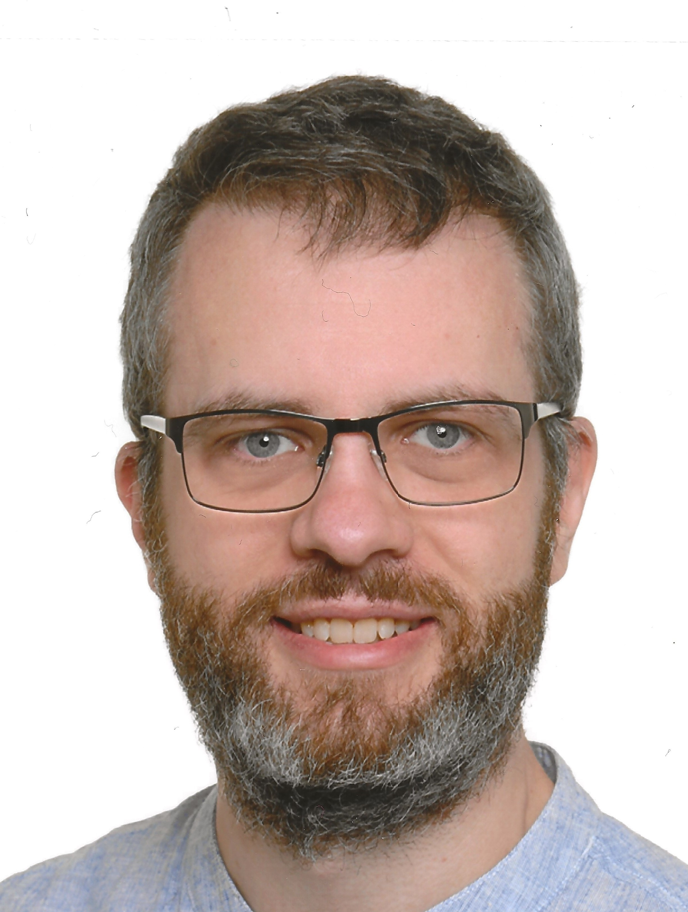

::: {.content-block .hero-section}
::: {.hero-grid}
::: {.hero-copy}
# Paavo Sattler {.hero-name}

## Statistical Methodology for Complex Data and Structured Inference {.hero-subtitle}

[TU Dortmund University](https://msind.statistik.tu-dortmund.de/professur/team/paavo-sattler/){.affiliation-link data-goatcounter-click="affiliation-tu-dortmund"}  
[RWTH Aachen University](https://rwthcontacts.rwth-aachen.de/person/PER-BVK529W){.affiliation-link data-goatcounter-click="affiliation-rwth-aachen"}

My research develops statistical methodology for complex multivariate and high-dimensional data, with particular interests in nonparametric inference, structured and directional hypotheses, multiple testing, and resampling-based methods. I am especially interested in the mathematical structures behind statistical procedures and in turning methodological ideas into practical tools and software.

::: {.profile-links}
[Google Scholar](https://scholar.google.de/citations?user=MXSrCMkAAAAJ){data-goatcounter-click="profile-google-scholar"}
[ORCID](https://orcid.org/0000-0001-8731-0893){data-goatcounter-click="profile-orcid"}
[GitHub](https://github.com/PaavoSattler){data-goatcounter-click="profile-github"}
[CV](about.qmd#cv){data-goatcounter-click="profile-cv"}
[Email](mailto:paavo.sattler@tu-dortmund.de){data-goatcounter-click="contact-email-home"}
:::
:::

::: {.hero-photo}
{.profile-image alt="Portrait of Paavo Sattler"}
:::
:::
:::

::: {.content-block}
## Research Interests

::: {.topic-grid}
::: {.research-topic}
### Multivariate & High-Dimensional Inference
I develop methods for inference in complex multivariate settings, including repeated-measures designs, covariance and correlation structures, and high-dimensional data where classical low-dimensional procedures may no longer be appropriate.
:::

::: {.research-topic}
### Nonparametric & Resampling-Based Inference
A central part of my work concerns statistical procedures that rely on comparatively weak distributional assumptions, including bootstrap, permutation, and randomization-based methods for heterogeneous and complex designs.
:::

::: {.research-topic}
### Structured, Multiple & Directional Hypotheses
I am interested in statistical inference for structured hypotheses, multiple comparisons, and directional or one-sided alternatives. This includes multiple contrast procedures as well as questions concerning the representation and geometry of statistical hypotheses.
:::

::: {.research-topic}
### Statistical Computing
Methodological developments are most useful when they can actually be applied. I therefore also work on efficient implementations and statistical software that make new procedures accessible for practical data analysis.
:::
:::

[Explore my research →](research.qmd){.section-link}
:::

::: {.content-block .soft-section}
## Current Research

::: {.project-grid}
::: {.project-card}
### Directional & One-Sided Inference
Current work focuses on statistical methodology for directional and superiority hypotheses in multivariate settings. The aim is to move beyond testing for mere differences and to address questions in which the direction or superiority of an effect is scientifically relevant, with a particular focus on biostatistical applications.

DFG-funded project · planned start 2027
:::

::: {.project-card}
### Randomization-Based Inference with Missing Data
A current research direction concerns randomization-based inference for relative effects in repeated-measures and factorial designs with incomplete observations. Recent work accounts for the stochastic variability introduced by missing observations and combines this with randomization-based inference.

[Dobler, Kuhn, Amro & Sattler (2026) →](https://arxiv.org/abs/2609.07435){data-goatcounter-click="arxiv-dobler-2026"}
:::

::: {.project-card}
### Combined Parameters
Another ongoing project considers inference for statistical parameters that combine different aspects of a distribution or different effect measures. The project investigates how such combined parameters can be incorporated into a coherent inferential framework.
:::

::: {.project-card}
### Covariate Adjustment for Nonparametric Effects
Building on existing NANCOVA methodology, current work extends covariate-adjusted inference to Mann–Whitney effects. The project studies how covariate information can be incorporated into inference for these effects in complex designs.
:::
:::
:::

::: {.content-block}
## Statistical Software

Software development is an integral part of my methodological research. The packages below provide implementations of statistical methods developed in my work and make them available for practical data analysis.

::: {.software-grid}
::: {.software-card}
### CovCorTest
**Inference for covariance and correlation structures**

An R package for testing general hypotheses about covariance and correlation matrices in multivariate designs.

[CRAN](https://CRAN.R-project.org/package=CovCorTest){data-goatcounter-click="software-cran-covcortest"} · [Details](software/covcortest.qmd)
:::

::: {.software-card}
### hdrm
**High-dimensional repeated-measures inference**

An R package implementing methodology for statistical inference in high-dimensional repeated-measures and split-plot designs.

[Details](software/hdrm.qmd)
:::

::: {.software-card}
### HypoShrink
**Simplifying linear hypotheses for efficient inference**

Tools for constructing and comparing simplified representations of linear hypotheses in quadratic-form-based inference.

[GitHub](https://github.com/PaavoSattler/HypoShrink){data-goatcounter-click="software-github-hyposhrink"} · [DOI](https://doi.org/10.5281/zenodo.17214498){data-goatcounter-click="software-doi-hyposhrink"} · [Details](software/hyposhrink.qmd)
:::
:::

[View all software →](software.qmd){.section-link}
:::

::: {.content-block}
## Selected Publications

::: {.publication-entry}
2026

### Quadratic form based multiple contrast tests for comparison of group means
**Paavo Sattler**, Markus Pauly, Merle Munko  
*Journal of Statistical Planning and Inference*

Develops quadratic-form-based multiple contrast procedures for simultaneous inference on comparisons between group means.

[DOI](https://doi.org/10.1016/j.jspi.2026.106414){data-goatcounter-click="doi-mct-2026"} · [arXiv](https://arxiv.org/abs/2411.10121){data-goatcounter-click="arxiv-mct-2026"}
:::

::: {.publication-entry}
2026

### Testing for patterns and structures in covariance and correlation matrices
**Paavo Sattler**, Dennis Dobler  
*Journal of Multivariate Analysis*

Develops inference procedures for testing structured patterns and restrictions in covariance and correlation matrices.

[DOI](https://doi.org/10.1016/j.jmva.2025.105517){data-goatcounter-click="doi-patterns-2026"} · [arXiv](https://arxiv.org/abs/2310.11799){data-goatcounter-click="arxiv-patterns-2026"}
:::

::: {.publication-entry}
2025

### Choice of the hypothesis matrix for using the Anova-type-statistic
**Paavo Sattler**, Manuel Rosenbaum  
*Statistics & Probability Letters*

Studies how the choice of hypothesis representation affects ANOVA-type inference and can be used to reduce computational complexity and runtime.

[DOI](https://doi.org/10.1016/j.spl.2025.110356){data-goatcounter-click="doi-ats-2025"} · [arXiv](https://arxiv.org/abs/2409.12592){data-goatcounter-click="arxiv-ats-2025"}
:::

::: {.publication-entry}
2023

### Testing hypotheses about correlation matrices in general MANOVA designs
**Paavo Sattler**, Markus Pauly  
*TEST*

Provides methodology for testing general hypotheses about correlation matrices in heterogeneous multivariate designs.

[DOI](https://doi.org/10.1007/s11749-023-00906-6){data-goatcounter-click="doi-correlation-2023"} · [arXiv](https://arxiv.org/abs/2209.04380){data-goatcounter-click="arxiv-correlation-2023"}
:::

::: {.publication-entry}
2018

### Inference for high-dimensional split-plot-designs: A unified approach for small to large numbers of factor levels
**Paavo Sattler**, Markus Pauly  
*Electronic Journal of Statistics*

Provides a unified framework for inference in high-dimensional split-plot designs across different dimensional regimes.

[DOI](https://doi.org/10.1214/18-EJS1465){data-goatcounter-click="doi-splitplot-2018"} · [arXiv](https://arxiv.org/abs/1706.02592){data-goatcounter-click="arxiv-splitplot-2018"}
:::

[View all publications →](publications.qmd){.section-link}
:::

::: {.content-block .philosophy-section}
## Research Philosophy

> “The most exciting phrase to hear in science, the one that heralds new discoveries, is not ‘Eureka!’ but ‘That’s funny…’”
>
> — Isaac Asimov

For me, research often begins with small observations: an unexpected pattern, a mathematical detail that behaves differently than anticipated, or a question that initially appears almost incidental.

I enjoy understanding these phenomena and following where they lead. Scientific progress does not always arise from a single major breakthrough. Often, it develops through many smaller steps — by gradually understanding mathematical structures, identifying new questions, and building methods around them.

This curiosity about mathematical and statistical phenomena, together with the process of turning theoretical insights into methodology, computation, and practical tools, is a central part of how I approach research.
:::

::: {.content-block .collaboration-home}
## Interested in collaboration?

I am interested in research collaborations that connect statistical methodology with substantive scientific problems and create opportunities to apply, adapt, or further develop existing methods.

::: {.collab-primary}
### Applications and Extensions of Methods & Software
I am particularly interested in projects where methods or software from my previous work provide a useful starting point for an existing statistical problem. This may involve direct application, but also targeted adaptations or methodological extensions when the original framework does not fully match the problem at hand. Such collaborations can support substantive research while also revealing new questions and opportunities for further methodological development.
:::

::: {.collab-grid}
::: {.collab-card}
### Integration into Broader Methodological Frameworks
I am also interested in collaborations that place individual methods, software packages, or research ideas within a broader methodological or scientific context. This may involve integrating existing approaches into larger frameworks, combining them with other methods, or embedding them into more comprehensive software and analysis workflows.
:::

::: {.collab-card}
### Methodological Collaboration
More generally, I am open to research collaborations in areas closely related to my methodological interests, particularly when statistical questions form an integral part of the scientific problem and benefit from a deeper methodological perspective.
:::
:::

[Get in touch →](mailto:paavo.sattler@tu-dortmund.de){.primary-button data-goatcounter-click="contact-email-collaboration-home"}
:::
